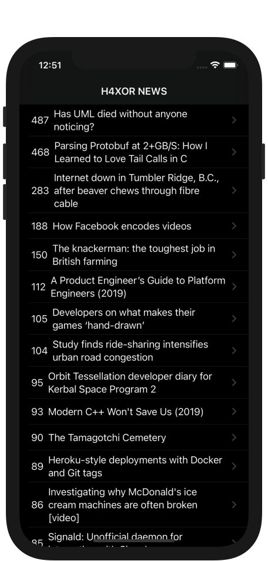
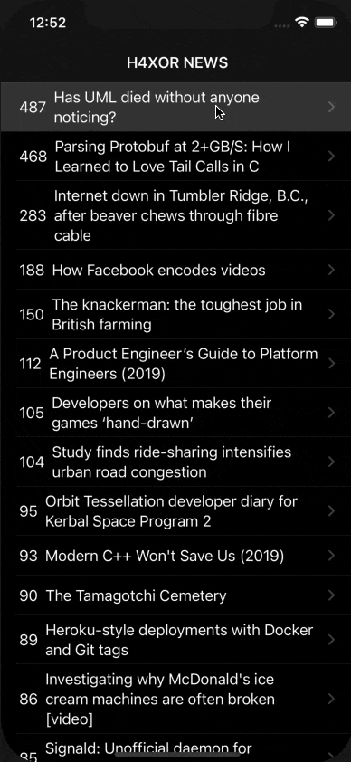

# SwiftUI-HackerNews
### Screen Shots

---

### Table of Contents

- [Description](#description)
- [How To Use](#how-to-use)
- [Author Info](#author-info)

## Description

- Live Hacker News app which fetches weather from https://hn.algolia.com/api

---

### What I Learned:

- Networking using SwiftUI
- NavigationView
- Navigation Link
- Lists in SwiftUI
- Using UIkit components in SwiftUI (WebView)

---

## How To Use

- Clone the project and run it on Xcode
---

## Author Info
- Website - [LinkedIn: Gurpreet Singh](https://www.linkedin.com/in/gurpreet-singh-a2651b107/)

[Back To The Top](#SwiftUI-HackerNews)
